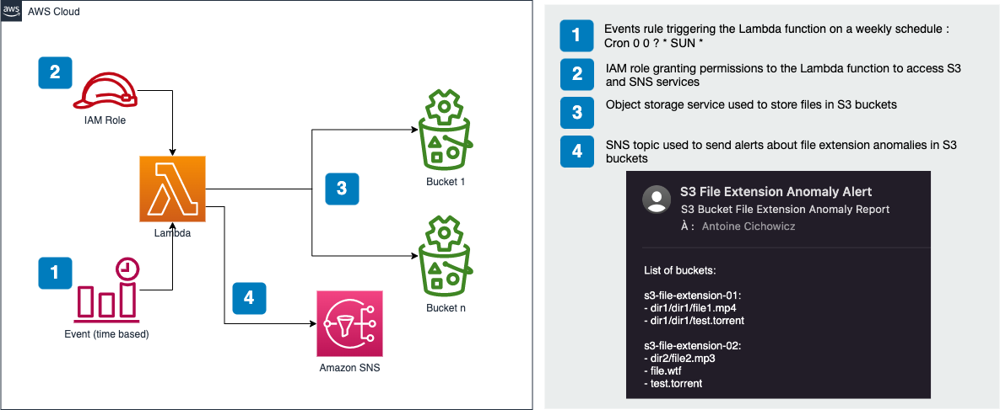

# S3 File Extention Scanner 

	
	
	
	

A serverless solution built with AWS CloudFormation to scan S3 buckets for file extension anomalies. It utilizes AWS Lambda, Amazon S3, and Amazon SNS to detect files with specific extensions and send email notifications. Keep your S3 buckets secure and organized with this automated scanning solution.

## Solution Architecture

## Key Components

- AWS CloudFormation
- AWS Lambda
- Amazon S3
- Amazon SNS
- AWS Events

## Configuration

Before deploying the CloudFormation stack, make sure to update the following configuration parameters in the CloudFormation template:

- `BucketList`: Comma-separated list of buckets to check.
- `EmailAddress`: The email address to receive the notification.
- `CronStart`: The cron expression for scheduling the scan.

## Usage

1. Deploy the CloudFormation stack using the provided template.
2. Once the stack is deployed, the Lambda function will start scanning the specified S3 buckets for file extension anomalies.
3. If any anomalies are detected, an email notification will be sent to the configured email address via Amazon SNS.
4. The scan can be scheduled using AWS Events by modifying the `CronStart` parameter in the CloudFormation template.

## Note

- Make sure the IAM role associated with the Lambda function has the necessary permissions to access S3 buckets and publish messages to SNS topics.
- Ensure that the specified S3 buckets have the appropriate permissions for the Lambda function to list objects.

## Usage Limits

- The solution is subject to the usage limits of the AWS services involved, such as Lambda. If there is a large number of buckets and files inside them, the Lambda function may take longer to execute and may even timeout after 900 seconds. 

## Security

See [CONTRIBUTING](CONTRIBUTING.md#security-issue-notifications) for more information.

## License

This repository is licensed under the Apache License 2.0. See the LICENSE file.
